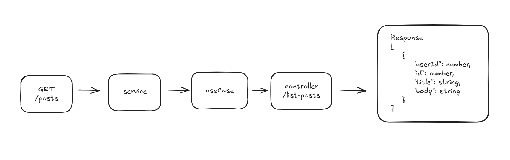
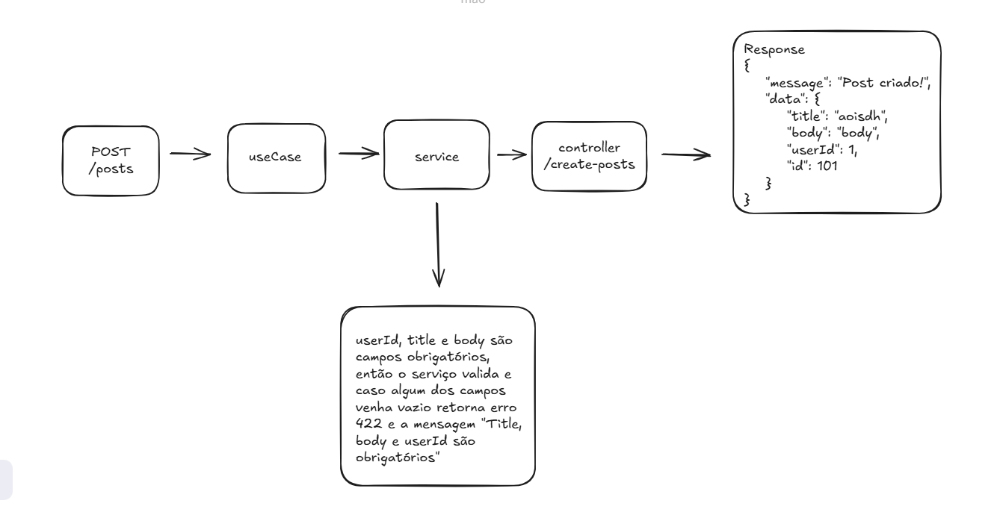
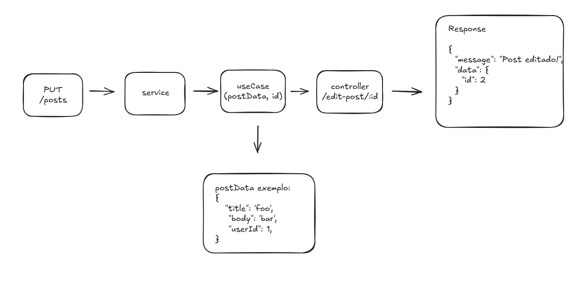

# BFF-Express-JS

Esse projeto foi desenvolvido utilizando Javascript, NodeJS, Express, Axios e Jest.

## 🤯 Desenho dos fluxos:

1. GET
   

2. POST
   

3. PUT
   

## 🛠️ Preparando o ambiente:

1. 🔮 Primeiro instale as dependencias do projeto:

```bash
npm install
```

2. 🚧 Inicie o projeto:

```bash
npm start
```

3. 🧪 Rode os testes unitários:

```bash
npm test
```
